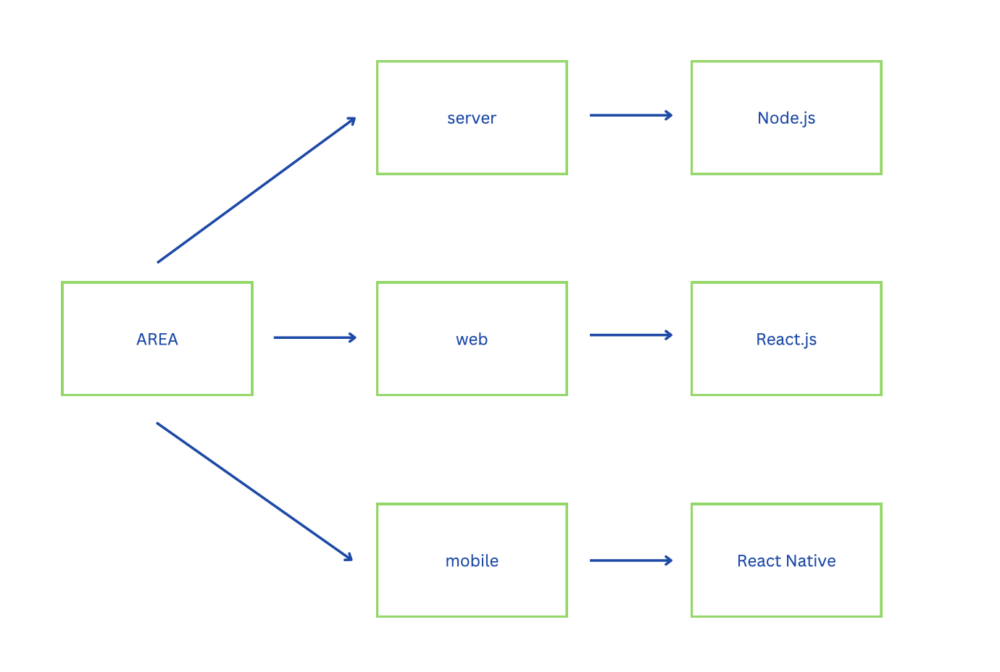
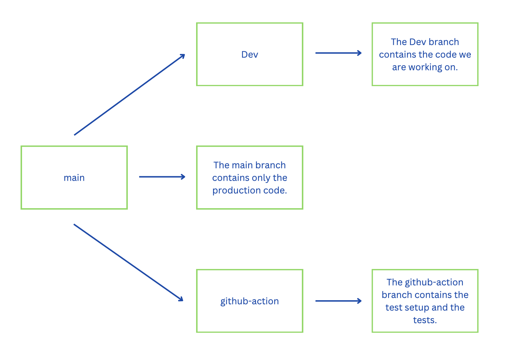

# Project AREA

**The goal of this project :**

The goal of this project is to discover, as a whole, the software platform that you have chosen through the creation of a business application.

To do this, you must implement a software suite that functions similar to that of IFTTT and/or Zapier.

> - An application server to implement all the features listed below.
> - A web client to use the application from your browser by querying the application server.
> - A mobile client to use the application from your phone by querying the application server.

**AREA :**

After subscribing to different services, the authenticated user can create some AREA in order to execute a REAction when an Action is found.

> Example our Area :
> 
> - Youtube / Telegram
> - Action : A received notification from an account we follow
> - REAction : A message is sent on Telegram

# Summary

**- General informations**

**- Folder architecture**

**- Branchs**

**- Services**

**- API**

# General informations

We were in a group of 4 persons to complete the project in 2 months.

We used Node.js, React.js and React native to develop our project.

The compilation is done with Docker :

> docker-compose up --build

# Folder architecture

We have created 3 folders in our github repository :

***server*** which act as the master node of the application. It contains all the logic of the actions and reactions. (The use of Node.js and Express.js)

***web*** which expose a website to interact with the AREA. (The use of React.js)

***mobile*** which expose a mobile application to interact with the AREA. (The use of React Native to be cross-platform)



# Branchs



# Services

**Actions**

***Youtube*** : Trigger every time a video is posted by a specified user.

***Weather*** : 

(1) Trigger every time it starts/stops freezing.

(2) Trigger every time it starts/stops raining.

(3) Trigger every time it is day/night.

(4) Trigger every time when the wind is over 80km/h.

***F1*** : 

(1) Trigger every time new results available.

(2) Trigger every time new qualifying results available.

***NASA*** : Trigger every time a new photo of the day is posted.

**Reactions**

***Telegram*** : The bot sends you a private message.

***Discord*** :

(1) The bot sends you a private message.

(2) The bot sends you a public message in the 'general' channel with your @username.

(3) The bot sends you a public message in the 'general' channel with @everyone.

# API

**Server**

**Endpoints**

* [Auth](#auth)
    1. [Signup](#1-signup)
    1. [Login](#2-login)
    1. [userInfo](#3-userinfo)
    1. [Login With Google](#4-login-with-google)
    1. [isAuthenticated](#5-isauthenticated)
    1. [Logout](#6-logout)
    1. [about.json](#7-aboutjson)
* [Areas](#areas)
    1. [Create](#1-create)
    1. [Set status](#2-set-status)
    1. [Set last action](#3-set-last-action)
    1. [Delete](#4-delete)
    1. [Get](#5-get)
* [Action](#action)
    1. [Weather](#1-weather)
    1. [YouTube](#2-youtube)
    1. [F1](#3-f1)
    1. [NASA](#4-nasa)
* [Reaction](#reaction)
    1. [Telegram](#1-telegram)
    1. [Discord](#2-discord)

--------

**Auth**

**1. Signup**

***Endpoint:***

```bash
Method: POST
Type: RAW
URL: http://localhost:8080/api/auth/signup
```

***Body:***

```js        
{
    "username": "Anto",
    "password": "test"
}
```

**2. Login**

***Endpoint:***

```bash
Method: POST
Type: RAW
URL: http://localhost:8080/api/auth/signup
```

***Body:***

```js        
{
    "username": "Anto",
    "password": "test"
}
```

**3. userInfo**

***Endpoint:***

```bash
Method: GET
Type: RAW
URL: http://localhost:8080/api/auth/me
```

**4. Login With Google**

***Endpoint:***

```bash
Method: GET
Type: RAW
URL: http://localhost:8080/api/auth/google
```

***Body:***

```js        
{
    "tokenId": "962351901248-vt8o9io4adohtlihbs3lpdtlichv9kqn.apps.googleusercontent.com"
}
```

**5. isAuthenticated**

***Endpoint:***

```bash
Method: GET
Type: 
URL: http://localhost:8080/api/auth/isAuthenticated
```

**6. Logout**

***Endpoint:***

```bash
Method: POST
Type: RAW
URL: http://localhost:8080/api/auth/logout
```

***Body:***

```js        
{
    
}
```

**7. about.json**

***Endpoint:***

```bash
Method: GET
Type: 
URL: http://localhost:8080/about.json
```

**Areas**

**1. Create**

***Endpoint:***

```bash
Method: POST
Type: RAW
URL: http://localhost:8080/api/area/create
```

***Headers:***

| Key | Value | Description |
| --- | ------|-------------|
| Content-Type | application/json |  |

***Body:***

```js        
{
    "username": "bbbb",
    "action": "A youtuber posts a new video",
    "action_data": "https://www.youtube.com/c/aMOODIEsqueezie",
    "reaction": "Area's bot sends you a message",
    "reaction_data": "1764138339"
}
```

**2. Set status**

***Endpoint:***

```bash
Method: POST
Type: RAW
URL: http://localhost:8080/api/area/update
```

***Body:***

```js        
{
    "username": "test2",
    "_id": "1668278725225",
    "status": "true"
}
```

**3. Set last action**

***Endpoint:***

```bash
Method: POST
Type: RAW
URL: http://localhost:8080/api/area/setLastAction
```

***Body:***

```js        
{
    "username": "test2",
    "_id": "1668278725225",
    "last_action": "testlastaction"
}
```

**4. Delete**

***Endpoint:***

```bash
Method: DELETE
Type: RAW
URL: http://localhost:8080/api/area/delete
```

***Body:***

```js        
{
    "username": "test2",
    "_id": "1668265246894"
}
```

**5. Get**

***Endpoint:***

```bash
Method: POST
Type: RAW
URL: http://localhost:8080/api/area/get
```

***Body:***

```js        
{
    "username": "Anto"
}
```

**Actions**

**1. Weather**

***Endpoint:***

```bash
Method: 
Type: 
URL: 
```

**2. YouTube**

***Endpoint:***

```bash
Method: 
Type: 
URL: 
```

**3. F1**

***Endpoint:***

```bash
Method: 
Type: 
URL: 
```

**4. NASA**

***Endpoint:***

```bash
Method: 
Type: 
URL: 
```

**Reactions**

**1. Telegram**

***Endpoint:***

```bash
Method: 
Type: 
URL: 
```

**2. Discord**

***Endpoint:***

```bash
Method: 
Type: 
URL: 
```

# Members

Project made by William MALLEVAYS, Antoine PODVIN, Marine POTEAU and Brieuc LAVEUGLE